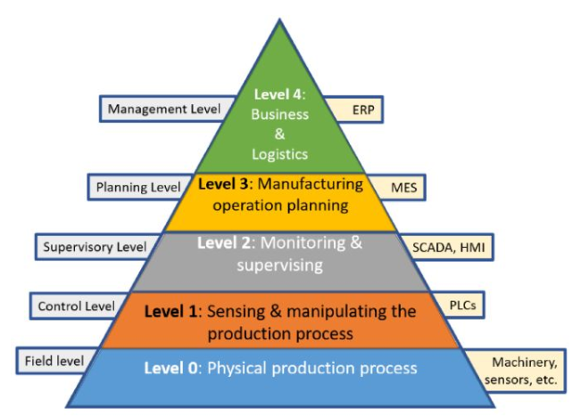
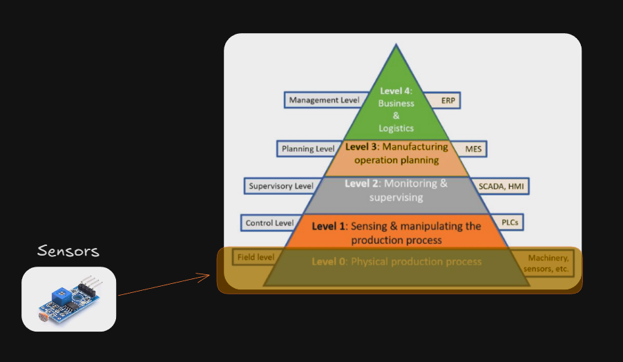
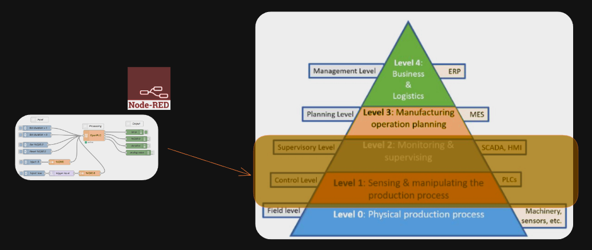
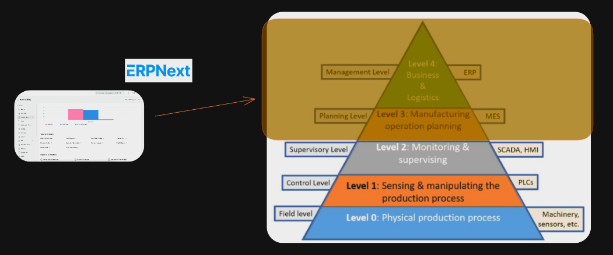

# Production Supporting Systems in Factories

---

# Smart Sensors and Information Systems

> อุปกรณ์ตรวจวัดอัจฉริยะและระบบสารสนเทศ

---

---

# ISA-95 Standard

- International standard for the integration of enterprise and control systems.
- Defines the hierarchy of systems in manufacturing operations.

---

# Level 0

- **Production Process**
- The actual physical and chemical processes on the plant floor.

## 

---

# Level 1

- **Sensing and Manipulation**
- Sensors and actuators that interact directly with the production process.

---

# Levels 2

- **Monitoring and Supervision**
- Systems like SCADA and HMI that monitor and control the process in real-time.

---

# Levels 3

- **Manufacturing Operations Management**
- Manages day-to-day production, including scheduling, quality, and inventory. MES (Manufacturing Execution System) is a key component here.

---

# Levels 4

- **Business Planning and Logistics**
- Handles enterprise-level functions like production planning, order processing, and supply chain management, typically managed by ERP systems.

---

# Note

- This diagram is rather conceptual and may not represent all real-world scenarios.
- In practice, systems can overlap and interact in complex ways.

---

# What are we doing in this course?

- We will use sensors and software that are related to these levels.
- I only pick the options that are accessible and affordable.
  - Open-source softwares
  - Low-cost sensors and devices
- But they are still relevant to real-world applications.

---

---

---

---

| Week   | Class | Topic                               |
| ------ | ----- | ----------------------------------- |
| 9 Feb  | 1, 2  | ERPNext (Intro, Purchase, Sales)    |
| 16 Feb | 3, 4  | ERPNext (Inventory, Manufacturing)  |
| 23 Feb | 5, 6  | Node-Red (Basic, MQTT, Integration) |
| 2 Mar  |       | Proposal Week                       |
| 9 Mar  |       | Project Presentation                |

---

# Let's go...
