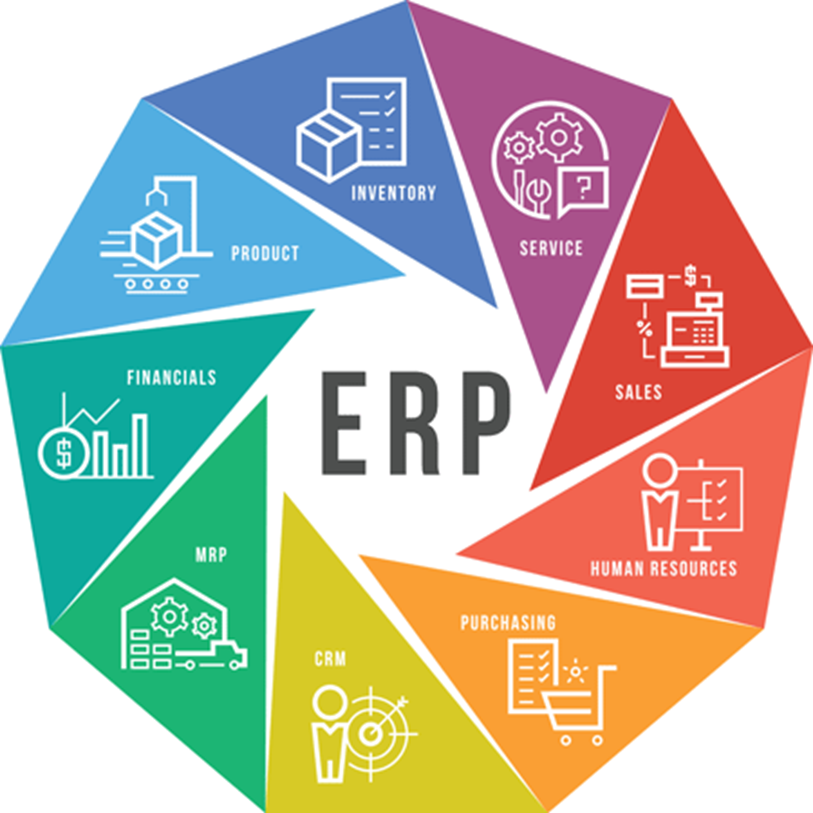
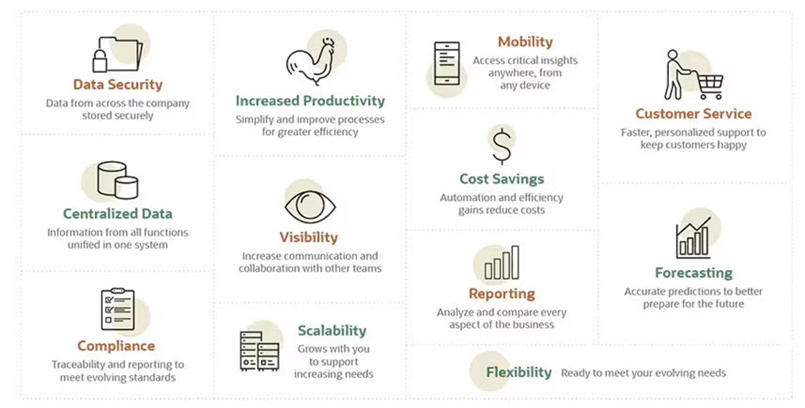
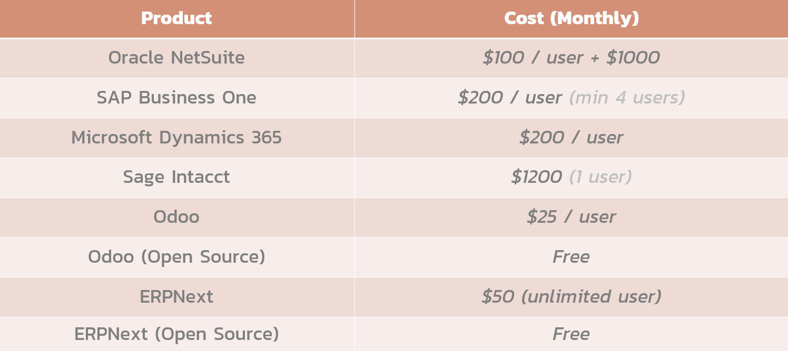
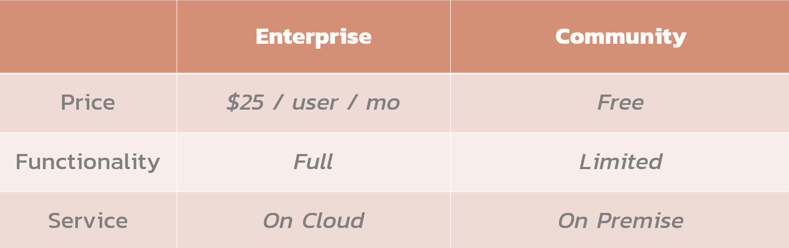
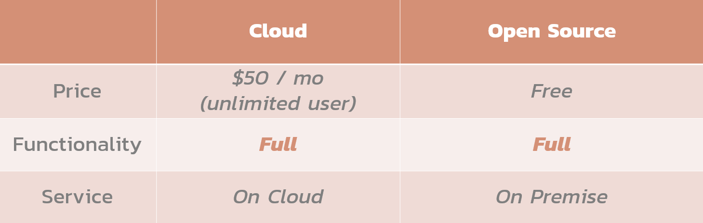

# Production Supporting Systems in Factories

---

# ERPNext

---

# What is ERP?

- Stands for _Enterprise Resource Planning_.
- Software that collects information from various departments in a common database
  - Unify critical business functions together.
  - Provide organization-wide visibility.

> Really complicated software

---

# Modules

---

# Benefits of ERP

---

# ERP Products

---

# Odoo

---

# ERPNext

---

# Let's try ERPNext!
