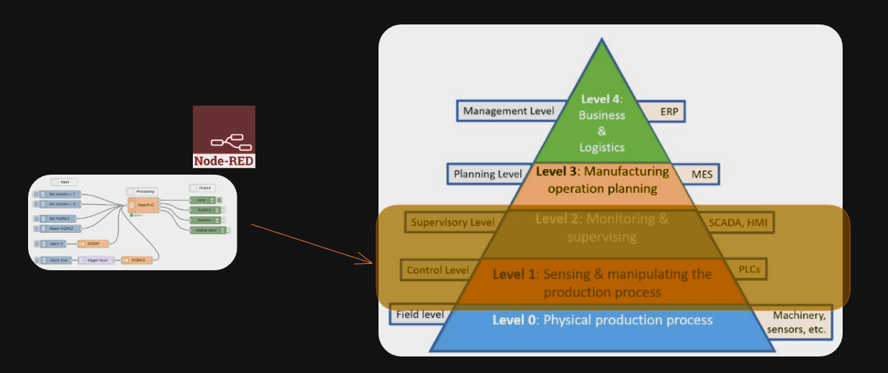

<style>
@import url('https://fonts.googleapis.com/css2?family=Prompt:ital,wght@0,100;0,300;0,400;0,700;1,100;1,300;1,400;1,700&display=swap');

    :root {
    font-family: Prompt;
    --hl-color: #D57E7E;
}
h1 {
  font-family: Prompt
}
</style>

# Production Supporting Systems in Factories

---

# Node-RED

---



---

# What is Node-RED?

- A low-code, visual programming tool that allows users to create applications by wiring together hardware devices, APIs, and online services using a web-based flow editor.
- It runs on Node.js and is well-suited for automating workflows and processing data, with popular applications in home automation, industrial control, and other event-driven systems.

---

# Navigating around `Node-RED`

---

# Create flows to

- Show timestamp in the `debug` panel.
- Show date and time using `function` node. _(See code on the other page.)_
- Send continuous random numbers. (Use `Math.random()`)
- Use `switch` and `change`.

---

```javascript
const date = new Date();
msg.payload = date.toDateString();
return msg;
```
