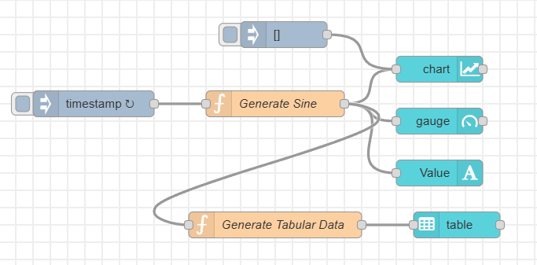
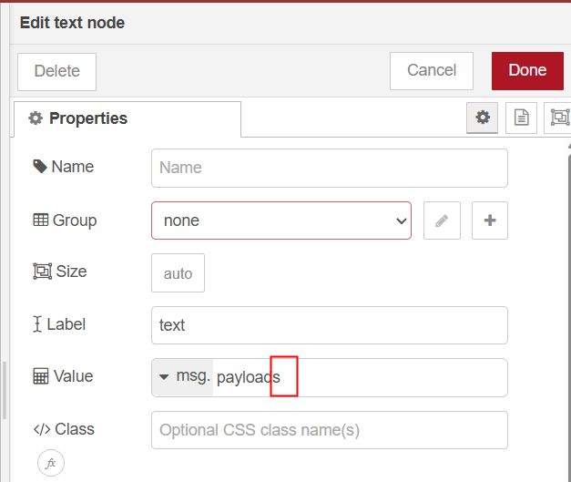
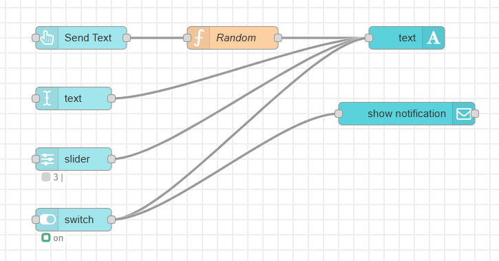

<style>
@import url('https://fonts.googleapis.com/css2?family=Prompt:ital,wght@0,100;0,300;0,400;0,700;1,100;1,300;1,400;1,700&display=swap');

    :root {
    font-family: Prompt;
    --hl-color: #D57E7E;
}
h1 {
  font-family: Prompt
}
</style>

# Production Supporting Systems in Factories

## ระบบสนับสนุนการผลิตในโรงงานอุตสาหกรรม

---

# Dashboard

---

# Install Dashboard Module

Only for local Node-RED installation

```
pnpm install @flowfuse/node-red-dashboard
```

---

# Dashboard

> Display

---



---

# Generate Sine

```js
const period = 10; // Period in seconds
const timestamp = new Date().getTime();
const tSeconds = timestamp / 1000;
const omega = (2 * Math.PI) / period; // angular frequency
const value = (Math.sin(tSeconds * omega) + 1) / 2;
msg.payload = Math.round(value * 100) / 100; // 2 decimal places
return msg;
```

---

# Bug



For the `text` node, you need to remove the extra "s".

---

# Generate Tabular Data

```js
const rows = [];

for (let i = 1; i <= 5; i++) {
  rows.push({
    ID: i,
    Name: "Item " + i,
    Value: msg.payload,
  });
}

msg.payload = rows;
return msg;
```

---

# Dashboard

> Control

---



---

# Random

```js
msg.payload = Math.random();
return msg;
```
