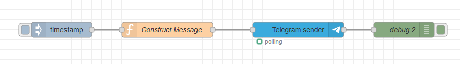
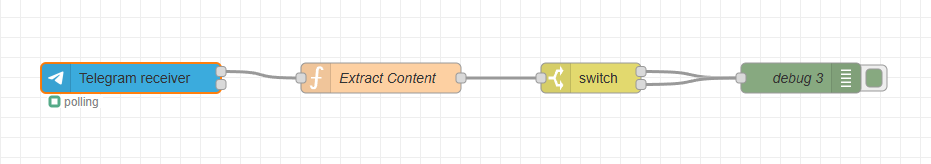
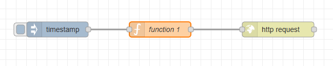
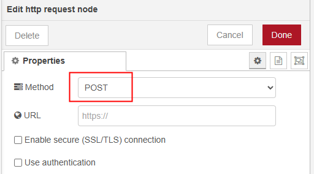

<style>
@import url('https://fonts.googleapis.com/css2?family=Prompt:ital,wght@0,100;0,300;0,400;0,700;1,100;1,300;1,400;1,700&display=swap');

    :root {
    font-family: Prompt;
    --hl-color: #D57E7E;
}
h1 {
  font-family: Prompt
}
</style>

# Production Supporting Systems in Factories

## ระบบสนับสนุนการผลิตในโรงงานอุตสาหกรรม

---

# Telegram Notify

---

# Information Needed

```bash
TOKEN=
URL_NOTIFY=https://api.telegram.org/bot${TOKEN}/sendMessage
URL_GETUPDATES=https://api.telegram.org/bot${TOKEN}/getUpdates
CHAT_ID=
```

---

# Steps (1/2)

- Sign up for telegram.
- Talk to `@BotFather`
  - Type `/newbot` to get `TOKEN`
- Construct `URL_NOTIFY`

---

# Steps (2/2)

- Talk to the bot.
- Construct `URL_GETUPDATES`
- Get `CHAT_ID` by visiting `URL_GETUPDATES`

---

# Using Telegram Node in Node-RED

---

# Flow



---

```js
CHAT_ID = XXXXXXXX; // Your chat ID here
const data = {
  chatId: CHAT_ID,
  content: msg.payload,
  type: "message",
};
msg.payload = data;
return msg;
```

---

# Receive Notification



---

```js
const content = msg.payload?.content ?? "";
msg.payload = content;
return msg;
```

---

# Using HTTP Request Node in Node-RED

---

# Flow



---

# `Construct Payload` node

```js
// Input your info here
const TOKEN = "";
const CHAT_ID = "";

// Store incoming message
const value = msg.payload;

// Construct "JSON"
msg.payload = {
  chat_id: CHAT_ID,
  text: value,
  type: "message",
};
msg.url = `https://api.telegram.org/bot${TOKEN}/sendMessage`;
return msg;
```

---

# HTTP Request Node Configuration



---

# Note on Performance

- Telegram Notify via HTTP Request Node may be slower than using Telegram Node.
- This is because each HTTP Request Node execution involves establishing a new connection to the Telegram servers.
  - This overhead can add latency, especially if multiple messages are sent in quick succession.
- In contrast, the Telegram Node maintains a persistent connection, allowing for faster message delivery.

---

# Note on Developer Experience

- Each time you deploy changes in Node-RED, the Telegram Node may take longer to initialize compared to standard nodes.
  - This is due to the need to re-establish the connection with the Telegram servers.
- Recommendation:
  - Use the HTTP Request Node.
  - Use Telegram Node but disable it during development and enable it only when needed.

---

# Using Webhook in ERPNext

---

# ERPNext Webhook

- `Webhook` is a way for an application to provide other applications with real-time information.
- It delivers data to other applications as it happens, meaning you get data immediately.
- ERPNext supports [Webhook](https://docs.frappe.io/framework/user/en/guides/integration/webhooks) to send data to other systems when certain events occur.

---

# Create Webhook in ERPNext

- Go to Frappe Framework > Integration > Webhook
- Create a new Webhook with the following details:
  - Document Type: `Sales Order`
  - Doc Event: `on_update`
  - Request URL: `URL_NOTIFY`
  - Request Method: `POST`
  - Request Structure: `JSON`
  - Webhook Data: See below

---

# Webhook Data

```json
{
  "chat_id": 6094132297,
  "text": "Updated: {{ doc.name }}",
  "type": "message"
}
```

---

# Test Webhook

- Create and Update a `Sales Order` document in ERPNext.
- See notification in Telegram.
- Note
  - Once you submit the Sales Order, further updates will not trigger the webhook.
  - `on_update` event is only triggered when the document is modified in the draft state.
