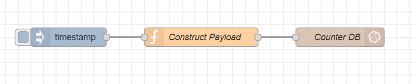
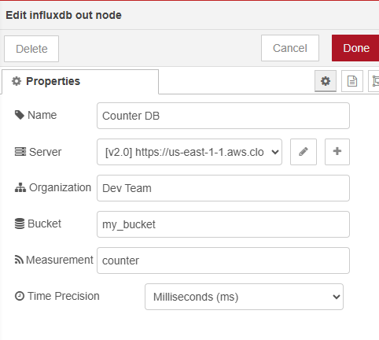
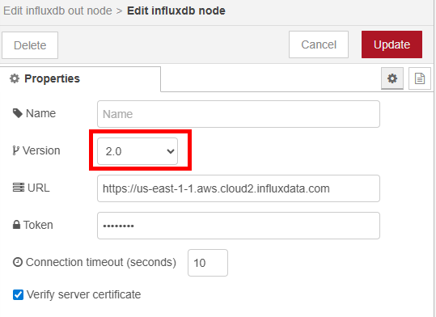
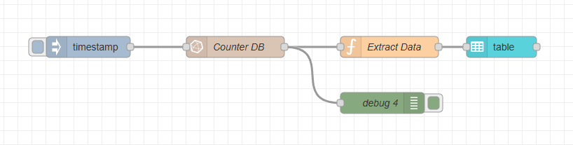
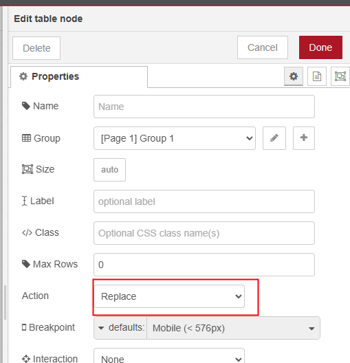

<style>
@import url('https://fonts.googleapis.com/css2?family=Prompt:ital,wght@0,100;0,300;0,400;0,700;1,100;1,300;1,400;1,700&display=swap');

    :root {
    font-family: Prompt;
    --hl-color: #D57E7E;
}
h1 {
  font-family: Prompt
}
</style>

# Production Supporting Systems in Factories

## ระบบสนับสนุนการผลิตในโรงงานอุตสาหกรรม

---

# Cloud Database

---

# InfluxDB

- InfluxDB is a time series database (TSDB) developed by the company InfluxData.
- It is used for storage and retrieval of time series data in fields such as operations monitoring, application metrics, Internet of Things sensor data, and real-time analytics.
- [Ranking](https://db-engines.com/en/ranking/time+series+dbms)
- [Performance](https://www.influxdata.com/blog/influxdb-is-27x-faster-vs-mongodb-for-time-series-workloads/)

---

# Get Started with InfluxDB

- Register for an account at [InfluxDB Cloud](https://www.influxdata.com/products/influxdb-cloud/).
- Create a new InfluxDB instance.
- Create a new organization and a new bucket.
- Create a new API token with all access permissions.

---

# You will need

```bash
CLUSTER_URL=
ORGANIZATION_NAME=
BUCKET_NAME=
API_TOKEN=
```

---

# InfluxDB Data Model

- **Organization**: A container for all your InfluxDB resources.
- **Bucket**: A named location where time series data is stored.
- **Measurement**: A container for time series data, similar to a table in relational databases.
- **Tag**: A key-value pair that is used to store metadata about a measurement.
- **Field**: A key-value pair that stores the actual data points in a measurement.

---

# Query Languages

- InfluxDB supports two query languages: `InfluxQL` and `Flux`.
- `InfluxQL` is similar to `SQL` and is used for querying time series data.
  - You will see this in Data Explorer in InfluxDB Cloud.
- `Flux` is a more powerful and flexible query language that allows for complex data processing and analysis.
  - You will use this in Node-RED to query data from InfluxDB.

---

# Example of `InfluxQL` Query:

```sql
SELECT mean("value") FROM "your_measurement_name" WHERE time > now() - 1h GROUP BY time(1m)
```

---

# Example of `Flux` Query:

```js
from(bucket: "your_bucket_name")
  |> range(start: -1h)
  |> filter(fn: (r) => r._measurement == "your_measurement_name")
  |> group(columns: ["_field"])
  |> mean()
```

---

# InfluxDB Node-RED Integration

- Use the `node-red-contrib-influxdb` package to integrate InfluxDB with Node-RED.

---

# Write Data to InfluxDB



---

# InfluxDB Node



---

# InfluxDB Configuration Node



- Choose InfluxDB v2, not v1.
- Use the API token for authentication.

---

# `Construct Payload` Function Node

```js
const field = {
  counter: msg.payload,
};
const tag = {
  tag_1: "TAG_1",
  tag_2: "TAG_2",
};
msg.payload = [field, tag];
return msg;
```

---

# Receive Data from InfluxDB



---

# Flux Query to Get Last 5 Records

```js
from(bucket: "my_bucket") // replace with your bucket name
    |> range(start: -2h)
    |> filter(fn: (r) => r._measurement == "counter" and r._field == "counter") // replace with your measurement and field
    |> group() // remove grouping so you get a single table
    |> sort(columns: ["_time"], desc: true)
    |> limit(n: 5)
```

---

# `Extract Data` Function Node

```js
const _payload = msg.payload;

msg.payload = _payload.map((d) => {
  const _dt = new Date(d["_time"]);
  const dt = _dt.toLocaleString(); // e.g. "11/30/2025, 9:37:46 AM"
  return {
    "Date/Time": dt,
    Tag_1: d["tag_1"], // replace with your actual tag key
    Tag_2: d["tag_2"], // replace with your actual tag key
    Count: d["_value"],
  };
});
return msg;
```

---

# Table Output


