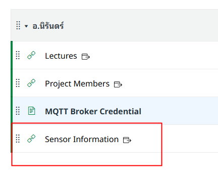

# Production Supporting Systems in Factories

## ระบบสนับสนุนการผลิตในโรงงานอุตสาหกรรม

---

# IoT sensor

---

# IoT Sensor Information

- [Link](https://docs.google.com/spreadsheets/d/1Fu4K1GY7FoQEcD8dgdNP_DjwT0qXIL2r5nEi0vZmBW0/edit?usp=sharing)

---

# Mobile Hotspot Settings

- Use SSID and Password from the IoT Sensor Information sheet.
- iPhone
  - Setting SSID: Go to **Settings** > **General** > **About** > **Name**
  - Set Password: Go to **Settings** > **Personal Hotspot** > **Wi-Fi Password**
    - Choose **Maximize Compatibility** for 2.4 GHz.
- Android
  - Go to **Settings** > **Network & internet** > **Hotspot & tethering** > **Wi-Fi hotspot**
  - Choose **2.4 GHz band**.

---

# MQTT Broker

- `Broker URL/IP`: `iecmu.com`
- `Port`: `1883`
- Authentication
  - `Username`: `iecmu`
  - `Password`: ...
