<style>
@import url('https://fonts.googleapis.com/css2?family=Prompt:ital,wght@0,100;0,300;0,400;0,700;1,100;1,300;1,400;1,700&display=swap');

    :root {
    font-family: Prompt;
    --hl-color: #D57E7E;
}
h1 {
  font-family: Prompt
}
</style>

# Production Supporting Systems in Factories

## ระบบสนับสนุนการผลิตในโรงงานอุตสาหกรรม

---

# Integration

> HTTP Request between ERPNext and Node-RED

---

# What is HTTP Request?

- HTTP (Hypertext Transfer Protocol) is the foundation of data communication on the World Wide Web.
- We can connect ERPNext and Node-RED via HTTP Request to exchange data.

---

# HTTP Methods

- `GET`: Retrieve data from a server.
- `POST`: Send data to a server to create a resource.

---

# HTTP `GET` Request Example

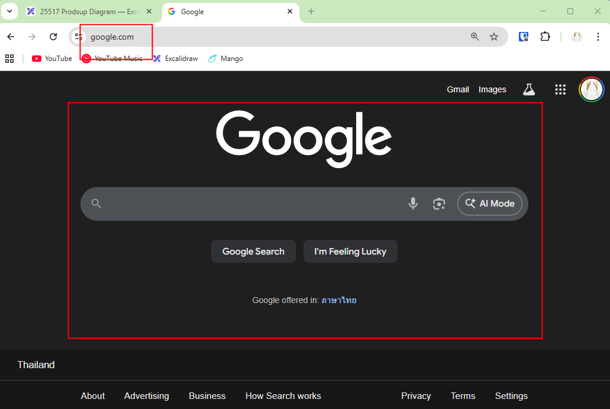

---

# Role

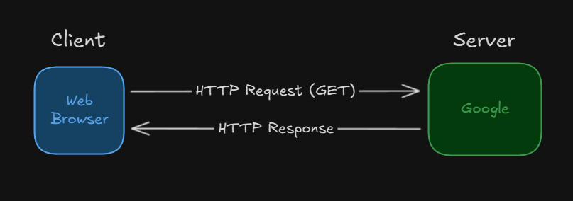

---

# Part 1:Node-RED to Google

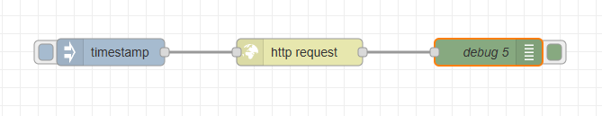

- Method: `GET`
- URL: `https://www.google.com`

---

# Role

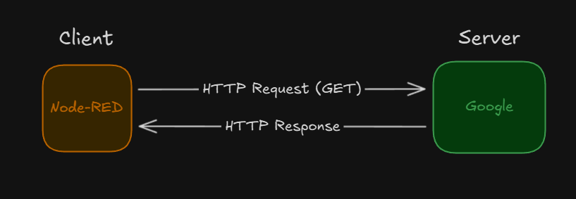

---

# Part 2: Node-RED to ERPNext

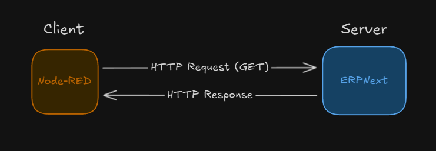

- We have to use [ERPNext API](https://docs.frappe.io/framework/user/en/api/rest).
  - _Application Programming Interface_

---

# ERPNext API Authentication

- ERPNext API requires authentication via `API Key` and `API Secret`.
- These can be generated from the User Settings in ERPNext.
- The `API Key` and `API Secret` are then combined to form a token for authorization.
- This token is included in the HTTP request **headers** to authenticate the request.

---

# Get API `Key` and `Secret`

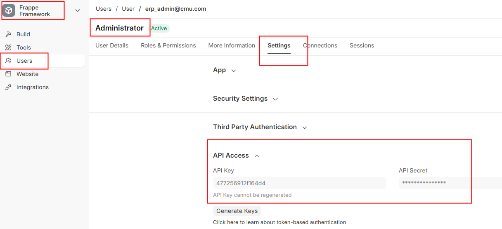

---

# Construct Token

```bash
KEY=
SECRET=
TOKEN=token ${KEY}:${SECRET}
```

_Note: The word "token" is required. There is a space between `token` and `${KEY}`._

---

# Construct URL

```bash
BASE_URL=https://pmX-erpXX.iecmu.com

URL1=${BASE_URL}/api/resource/Sales Order
URL2=${BASE_URL}/api/resource/Sales Order?fields=["*"]
URL3=${BASE_URL}/api/resource/Sales Order?fields=["*"]&filters=[["docstatus","=","1"]]
```

---

# HTTP Request Flow

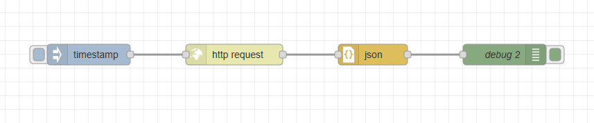

- Method: `GET`
- URL: `URL1`, `URL2`, or `URL3`
- Headers: `Authorization: ${TOKEN}`

---

# Headers


---

# JSON?

- _JavaScript Object Notation_
- A lightweight data-interchange format that is easy for humans to read and write, and easy for machines to parse and generate.

---

# Part 3: Node-RED as HTTP Server

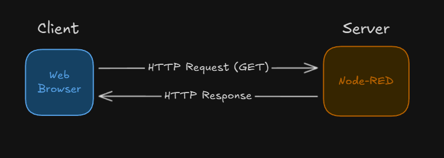

---

# Flow

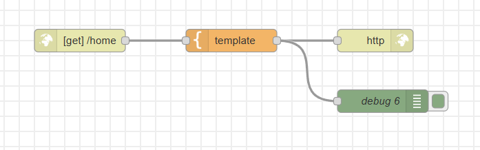

---

# HTTP In Node

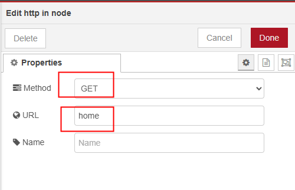

---

# Testing

- Construct `NODE_RED_URL`

```bash
NODE_RED_URL=https://pmX-nrXX.iecmu.com
```

- Visit `${NODE_RED_URL}/home` in your web browser.
  - You should see the message written in `Template` Node.

---

# Part 4: ERPNext to Node-RED

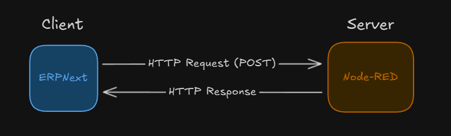

- Notice the `POST` method.

---

# Setup Node-RED HTTP Server

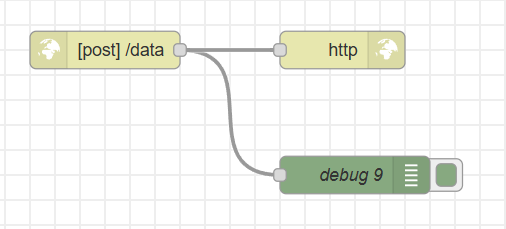

---

# HTTP-in Node

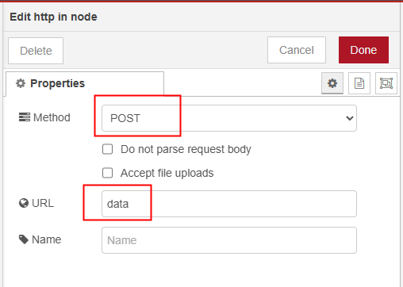

---

# ERPNext Webhook

- `Webhook` is a way for an application to provide other applications with real-time information.
- It delivers data to other applications as it happens, meaning you get data immediately.
- ERPNext supports [Webhook](https://docs.frappe.io/framework/user/en/guides/integration/webhooks) to send data to other systems when certain events occur.

---

# Create Webhook in ERPNext

- Go to Frappe Framework > Integration > Webhook
- Create a new Webhook with the following details:
  - Document Type: `Sales Order`
  - Doc Event: `on_update`
  - Request URL: `${NODE_RED_URL}/data`
  - Request Method: `POST`
  - Request Structure: `JSON`
  - Webhook Data: `{{ doc|tojson|safe }}`

---

# Test Webhook

- Create and Update a `Sales Order` document in ERPNext.
- Check the Node-RED Debug panel to see if the data is received.
- Note
  - Once you submit the Sales Order, further updates will not trigger the webhook.
  - `on_update` event is only triggered when the document is modified in the draft state.
