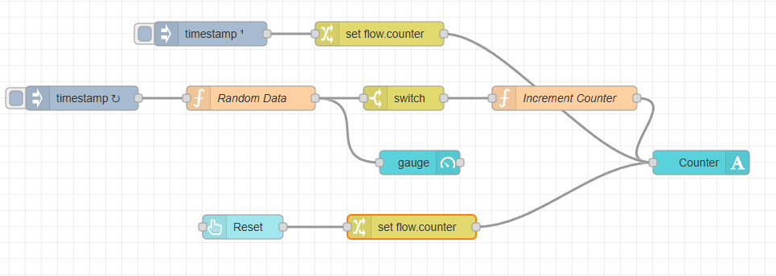
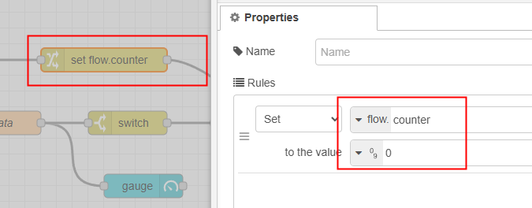
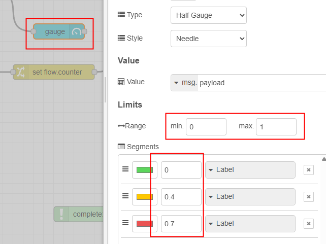
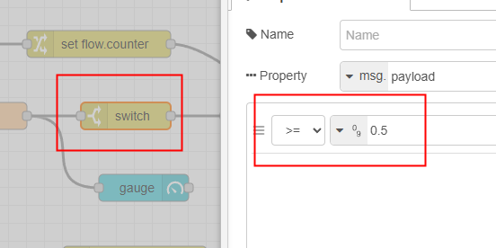
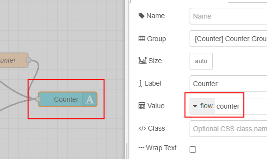
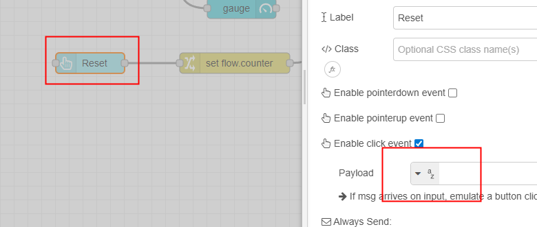
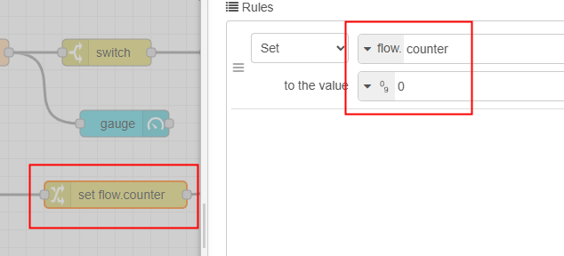
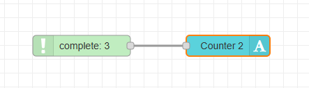
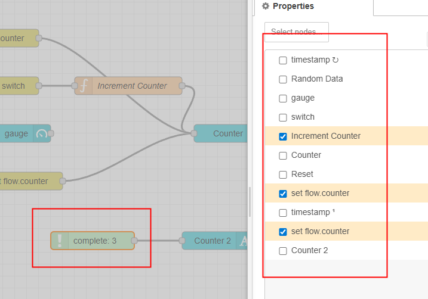

<style>
@import url('https://fonts.googleapis.com/css2?family=Prompt:ital,wght@0,100;0,300;0,400;0,700;1,100;1,300;1,400;1,700&display=swap');

    :root {
    font-family: Prompt;
    --hl-color: #D57E7E;
}
h1 {
  font-family: Prompt
}
</style>

# Production Supporting Systems in Factories

## ระบบสนับสนุนการผลิตในโรงงานอุตสาหกรรม

---

# Context (Advanced)

---

# Counter with Reset Button

---

# Flow



---

# Initial Setup



---

# `Random Data` Function Node

```js
const rand = Math.random();
msg.payload = Math.round(rand * 100) / 100;
return msg;
```

---

# Gauge Setup



---

# `Switch` node



---

# `Increment Counter` (Function) Node

```js
const curCounter = flow.get("counter") ?? 0;
flow.set("counter", curCounter + 1);
msg.payload = curCounter + 1;
return msg;
```

---

# `Text` Node Setup



---

# `button` node



- Notice no payload is set here.

---

# `change` node



---

# Cool-Trick with `Complete` Node



---

# `Complete` Node Setup



- No more confusing connections!
