<style>
@import url('https://fonts.googleapis.com/css2?family=Prompt:ital,wght@0,100;0,300;0,400;0,700;1,100;1,300;1,400;1,700&display=swap');

    :root {
    font-family: Prompt;
    --hl-color: #D57E7E;
}
h1 {
  font-family: Prompt
}
</style>

# Production Supporting Systems in Factories

## ระบบสนับสนุนการผลิตในโรงงานอุตสาหกรรม

---

# Context (Advanced)

---

# Turning Sensor Display On and Off

---

# Flow

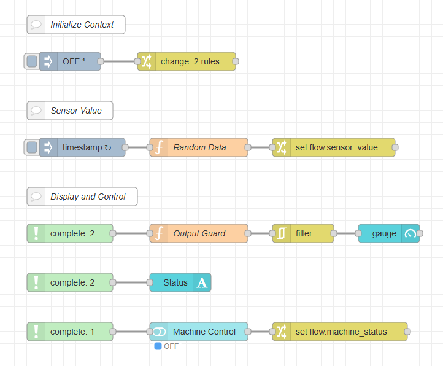

---

# `Inject` Node

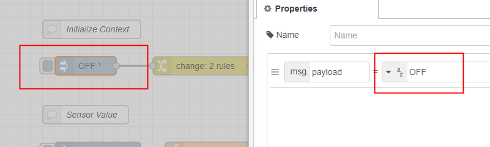

- This inject is for the button later.

---

# `Change` Node (Set Context)

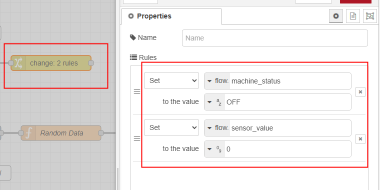

---

# `Random Data` Function Node

```js
const rand = Math.random();
msg.payload = Math.round(rand * 100) / 100;
return msg;
```

---

# `Change` Node (Set Sensor Context)

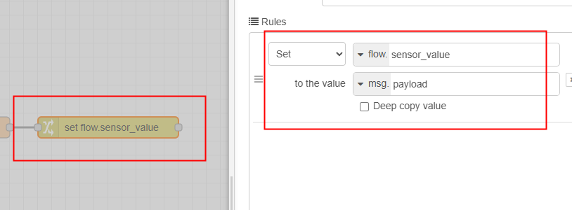

---

# `Sensor Value Handler` Function Node

```js
const machine_status = flow.get("machine_status") ?? "OFF";
const sensor_value = flow.get("sensor_value") ?? 0;

if (machine_status === "ON") {
  msg.payload = sensor_value;
} else {
  msg.payload = 0;
}
return msg;
```

---

# `Gauge` Node Setup

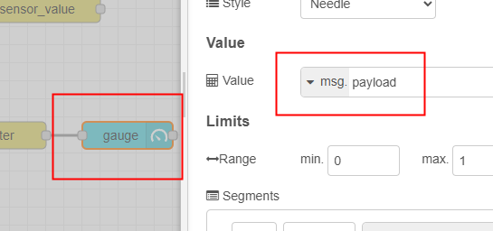

---

# `Text` Node Setup

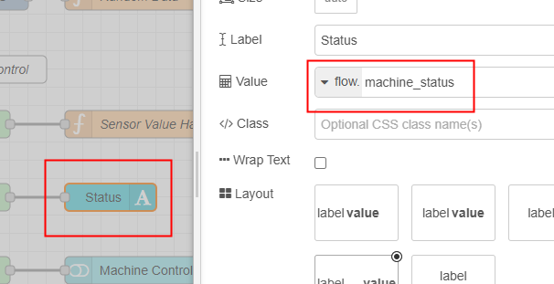

---

# `Button Group` Node Setup

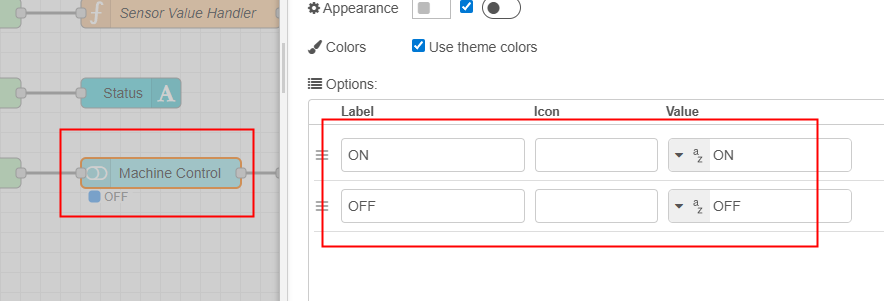

---

# `Change` Node (Set Machine Status Context)

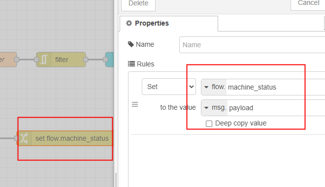

---

# `Complete` Node Setup

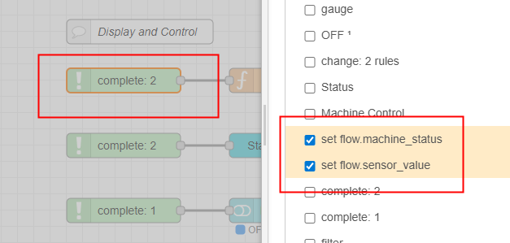

---

# `Complete` Node Setup

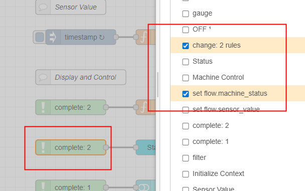

---

# `Complete` Node Setup

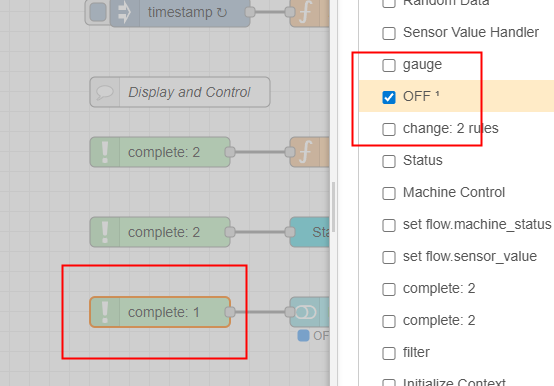
