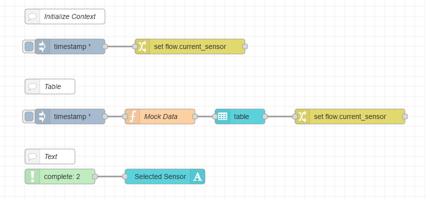
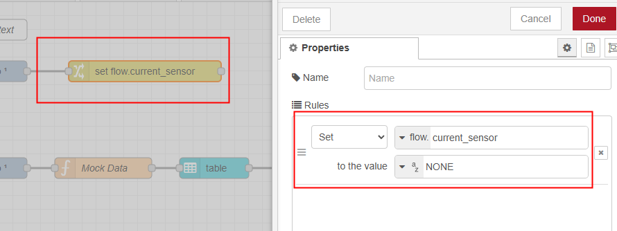
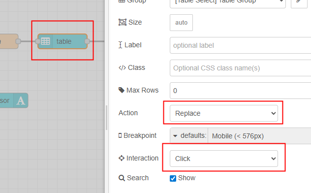
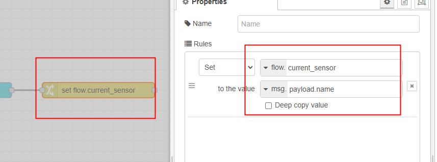
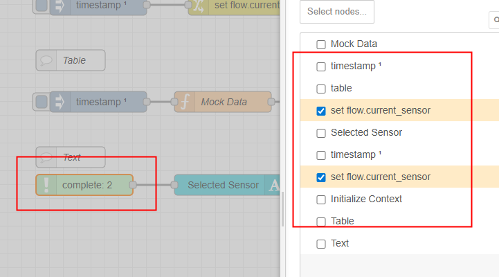
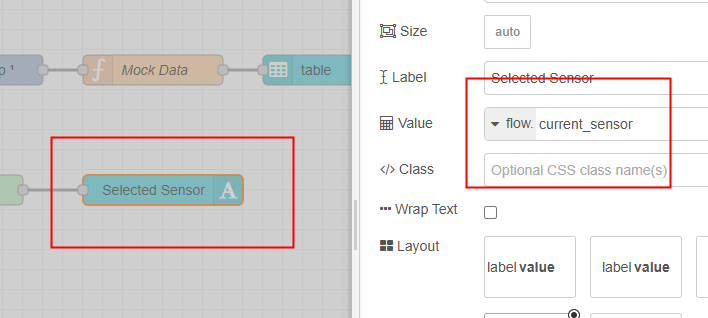

<style>
@import url('https://fonts.googleapis.com/css2?family=Prompt:ital,wght@0,100;0,300;0,400;0,700;1,100;1,300;1,400;1,700&display=swap');

    :root {
    font-family: Prompt;
    --hl-color: #D57E7E;
}
h1 {
  font-family: Prompt
}
</style>

# Production Supporting Systems in Factories

## ระบบสนับสนุนการผลิตในโรงงานอุตสาหกรรม

---

# Context (Advanced)

---

# Selecting Entry from Table

---

# Flow



---

# Initialize Context Variable



---

# `Mock Data` Function Node

```js
const data = [
  { id: 1, name: "Sensor A", status: "Active", value: 23.5 },
  { id: 2, name: "Sensor B", status: "Inactive", value: 18.2 },
  { id: 3, name: "Sensor C", status: "Active", value: 27.1 },
  { id: 4, name: "Sensor D", status: "Active", value: 19.8 },
  { id: 5, name: "Sensor E", status: "Inactive", value: 22.3 },
];

msg.payload = data;
return msg;
```

---

# `Table` Node Configuration



---

# `Change` Node to Set Context



---

# `Complete` Node



---

# `Text` Node


