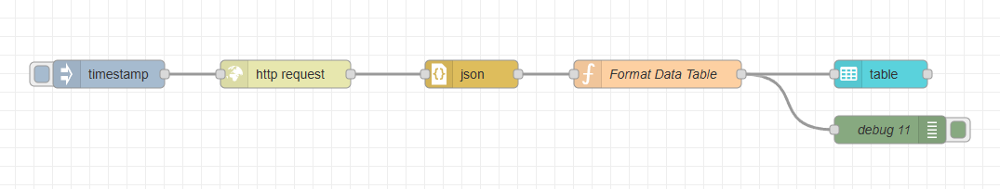
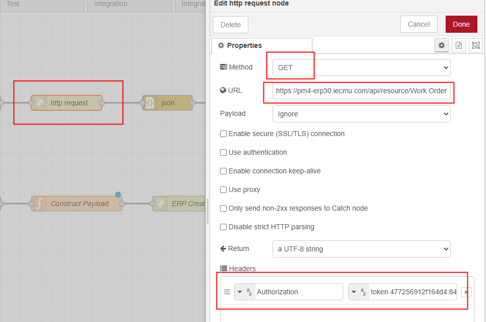
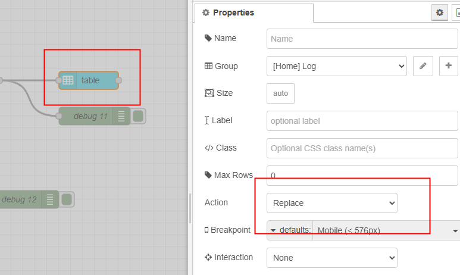
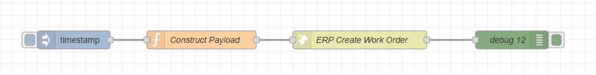
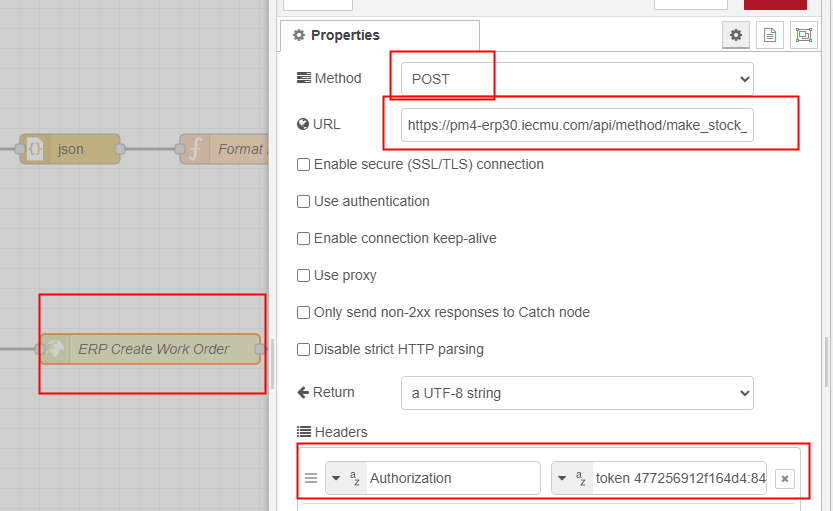

<style>
@import url('https://fonts.googleapis.com/css2?family=Prompt:ital,wght@0,100;0,300;0,400;0,700;1,100;1,300;1,400;1,700&display=swap');

    :root {
    font-family: Prompt;
    --hl-color: #D57E7E;
}
h1 {
  font-family: Prompt
}
</style>

# Production Supporting Systems in Factories

## ระบบสนับสนุนการผลิตในโรงงานอุตสาหกรรม

---

# Advanced Integration

> Retrieve Work Order from ERPNext and Create Stock Entry (Manufacture) via HTTP Request

---

# Information

```bash
KEY=
SECRET=
TOKEN=token ${KEY}:${SECRET}

BASE_URL=https://pmX-erpXX.iecmu.com
URL1=${BASE_URL}/api/resource/Work Order?fields=["*"]&filters=[["docstatus","=","1"],["status","in",["Not Started", "In Process"]]]
URL2=${BASE_URL}/api/method/make_stock_entry
```

---

# Retrieve Work Order from ERPNext



---

# HTTP `GET` Request



---

# `Format Data Table` Function Code

---

```js
const _data = msg.payload?.data;

// Validate that payload data is an array
if (!Array.isArray(_data)) {
  msg.payload = [];
  return msg;
}

// Format the data into a more readable table structure
const data = _data.map((d) => {
  return {
    Name: d["name"],
    Item: d["production_item"],
    "Target Qty": d["qty"],
    "To Be Produced": d["material_transferred_for_manufacturing"],
    Produced: d["produced_qty"],
  };
});

msg.payload = data;
return msg;
```

---

# `Table` Node



---

# Create Stock Entry via HTTP `POST` Request

---

# Create API Endpoint in ERPNext

- We need to create a custom API endpoint in ERPNext to handle the Stock Entry creation.
- Go to `Frappe Framework` -> `Build` -> `Server Script` -> `Add`
- Set `Script Type` to `API`
- Set `API Method` to `make_stock_entry`
  - If you change this name, remember to update the URL in Node-RED accordingly.
- Set `Script` to the following [code](https://github.com/prodsup-68/codes-erpnext-node-red/blob/main/erpnext/work_order/make_stock_entry.py)

---

# Node-RED Flow



---

# `Construct Payload` Function Code

```js
// Retrieve current work order and counter from flow context
// const current_work_order = flow.get("current_work_order");
// const counter = flow.get("counter")

// For demonstration purposes, we will hardcode these values
const current_work_order = "MFG-WO-2025-XXXX";
const counter = 1;

msg.payload = {
  work_order_id: current_work_order,
  purpose: "Manufacture",
  qty: counter,
};

return msg;
```

---

# `HTTP Request` Node Configuration


