<style>
@import url('https://fonts.googleapis.com/css2?family=Prompt:ital,wght@0,100;0,300;0,400;0,700;1,100;1,300;1,400;1,700&display=swap');

    :root {
    font-family: Prompt;
    --hl-color: #D57E7E;
}
h1 {
  font-family: Prompt
}
</style>

# Production Supporting Systems in Factories

## ระบบสนับสนุนการผลิตในโรงงานอุตสาหกรรม

---

# Machine Learning

> Image Classification

---

# Setting up ML server

- Get [code](https://github.com/prodsup-68/ml-express)
- `pnpm install`
- `pnpm run build`
- `pnpm run start`
- Test if server is running.
  - http://localhost:3003

---

# Install Additional Modules

- Go to Menu (top right) -> Manage palette -> Install
- Install the following modules:
  - `node-red-contrib-image-tools`
  - `@sumit_shinde_84/node-red-dashboard-2-ui-webcam`

---

# Prepare Mock Images

- Copy image from `ml-express/temp/img` to your node-red installation directory under `img` folder.

---

# Image input flow

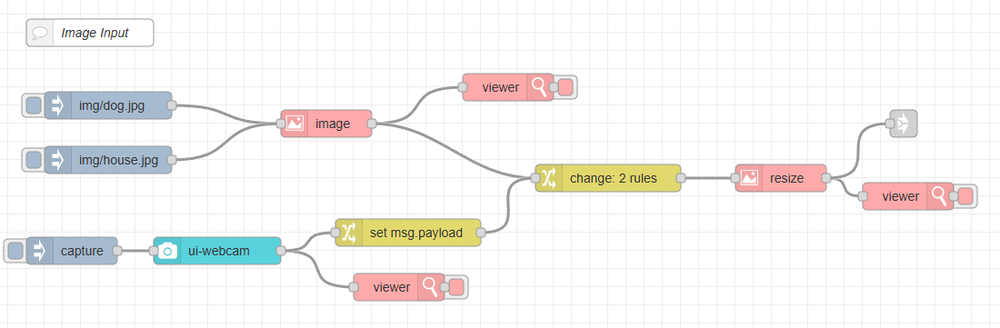

---

# `Inject` Node Configuration

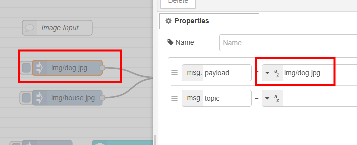

---

# `Image` Node Configuration

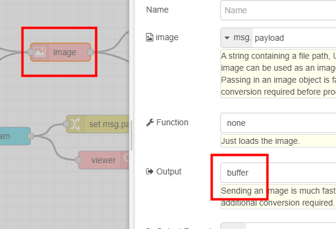
Change output to `buffer`.

---

# `Change` Node Configuration

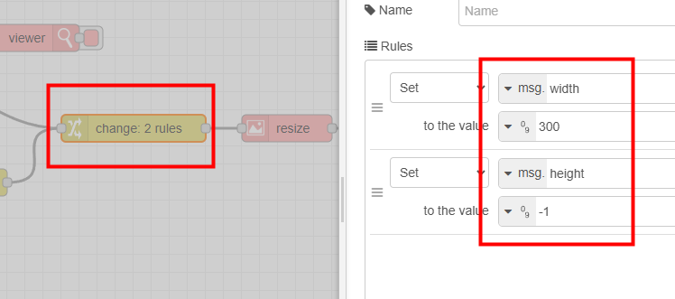
Setting width and height options.

---

# `Image` Node Configuration (Resize)

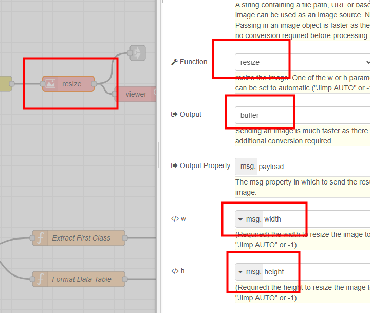

---

# `Inject` Node Configuration (Capture Image)

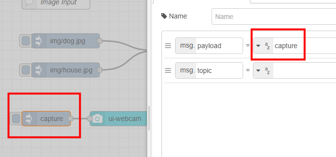
Set payload to `capture` to trigger webcam capture.

---

# `UI-Webcam` Node Configuration

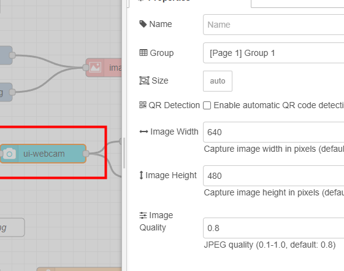
Leave default settings.

---

# `Change` Node Configuration

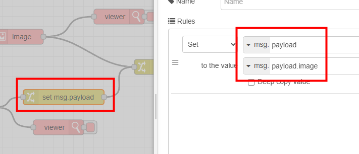
Extract `image` field from webcam output.

---

# Image-Processing Flow

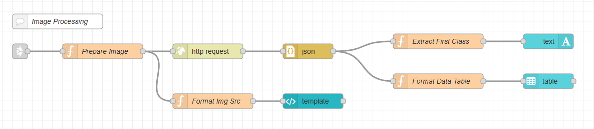

---

# Note

- I attempted to use `complete` node to link payload from `image` node (resize), but it did not get triggered as expected.
  - This might be due to the way `image` node works internally. (Probably not calling `node.done()` function)
- I will use `link` nodes to connect the two flows instead.

---

# `Prepare Image` Function Node

```js
msg.payload = { imageEncoded: Buffer.from(msg.payload).toString("base64") };
msg.headers = { "Content-Type": "application/x-www-form-urlencoded" };
msg.url = "http://localhost:3003/upload_base64"; // ML server endpoint
return msg;
```

---

# `HTTP Request` Node Configuration

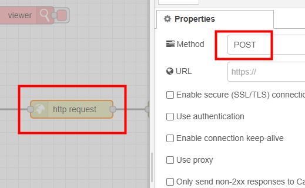

---

# `Extract First Class` Function Node

```js
const predictions = msg.payload?.predictions;
if (Array.isArray(predictions)) {
  msg.payload = predictions[0]?.class ?? "No Class Name";
} else {
  msg.payload = "No Class";
}
return msg;
```

---

# `Format Data Table` Function Node

```js
const predictions = msg.payload?.predictions;
if (!Array.isArray(predictions)) {
  msg.payload = [];
  return msg;
}

const dt = new Date();
const datestring = dt.toLocaleDateString();
const timestring = dt.toLocaleTimeString();
msg.payload = predictions.map((d) => ({
  Class: d["class"],
  Score: `${Math.round(d["score"] * 100)}%`,
  Time: `📆${datestring} ⏰${timestring}`,
}));
return msg;
```

---

# `Format Img Src` Function Node

```js
msg.payload = "data:image/jpeg;base64," + msg.payload.imageEncoded;
return msg;
```

---

# `UI-Template` Node Configuration

```jsx
<template>
  <div>
    
  </div>
</template>

<script>
export default {};
</script>
<style></style>
```

Display image from base64 string.

---

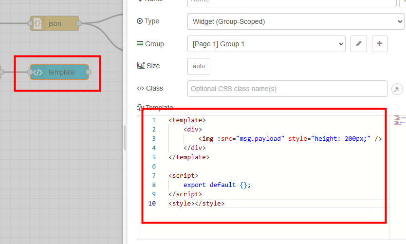

---

# Train your own model

- [Teachable machine](https://teachablemachine.withgoogle.com/)
- Create an image classification model.
- Download model and extract to `ml-express/public/model` folder.
