<style>
@import url('https://fonts.googleapis.com/css2?family=Prompt:ital,wght@0,100;0,300;0,400;0,700;1,100;1,300;1,400;1,700&display=swap');

    :root {
    font-family: Prompt;
    --hl-color: #D57E7E;
}
h1 {
  font-family: Prompt
}
</style>

# Production Supporting Systems in Factories

## ระบบสนับสนุนการผลิตในโรงงานอุตสาหกรรม

---

# Machine Learning

> Object Detection

---

# Object Detection

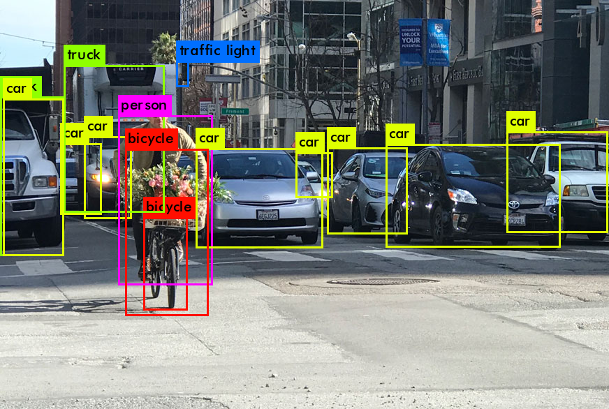

- Car
  - Top: 500, Bottom: 200, Left: 50, right: 400
  - 50%
- Bicycle
  - ...
  - ...

---

# COCO Dataset

- _Common Objects in Context_
- Large-scale image recognition dataset for object detection, segmentation, and captioning tasks.
  - Contains over 330,000 images.
  - Annotated with 80 object categories.
- https://cocodataset.org/#explore

---

# DETR Model

- [DEtection TRansformer](https://huggingface.co/facebook/detr-resnet-50) (DETR) model by Facebook AI.
- Uses transformer architecture for object detection.
- Pre-trained on COCO dataset.
- [Classes](https://tech.amikelive.com/node-718/what-object-categories-labels-are-in-coco-dataset/)

---

# Setting Up ML Server

- Get [code](https://github.com/prodsup-68/obj-detection-express)
- `pnpm install`
- `pnpm run build`
- `pnpm run start`
- Test if server is running.
  - http://localhost:3004

---

# Install Additional Modules

- Go to Menu (top right) -> Manage palette -> Install
- Install the following modules:
  - `node-red-contrib-image-tools`
  - `@sumit_shinde_84/node-red-dashboard-2-ui-webcam`

---

# Prepare Mock Images

- Copy image from `obj-detection-express-main/temp/img` to your node-red installation directory under `img` folder.

---

# Image Input Flow

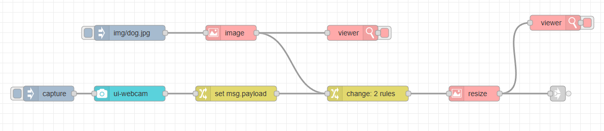

---

# `Inject` Node Configuration

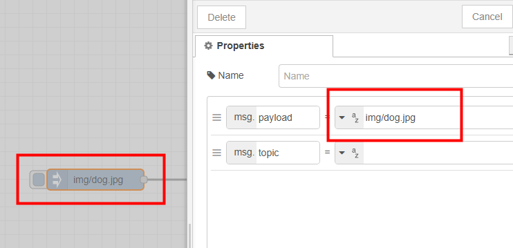

---

# `Image` Node Configuration

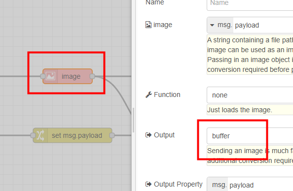

---

# `Change` Node Configuration

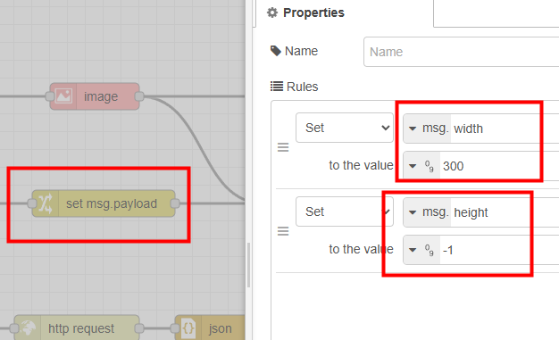

---

# `Image` Node Configuration (Resize)

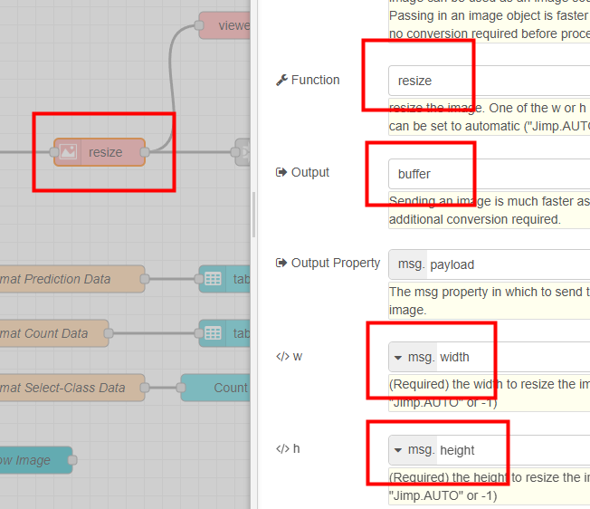

---

# `Inject` Node Configuration (Capture)

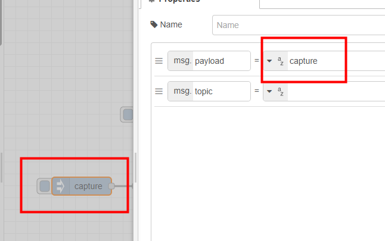

---

# `Change` Node Configuration (Webcam)

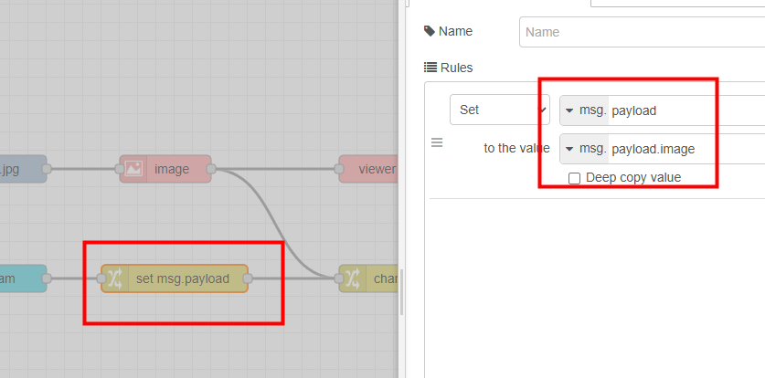

---

# Object Detection Flow

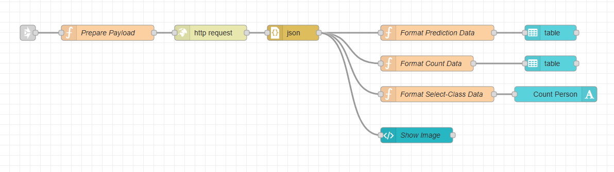

---

# `Prepare Payload` Function Node

```js
msg.headers = {
  "content-type": "multipart/form-data",
};
msg.payload = {
  img: {
    value: msg.payload,
    options: {
      filename: "a.jpg",
      contentType: "image/jpeg",
    },
  },
};
msg.url = "http://localhost:3004/upload"; // ML server endpoint
return msg;
```

---

# `HTTP Request` Node Configuration

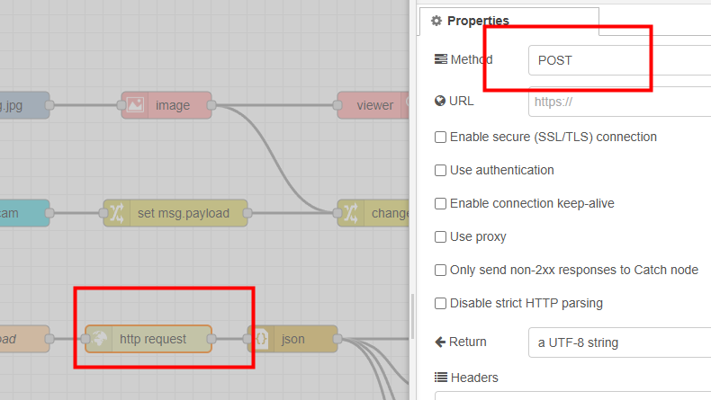

---

# `Format Prediction Data` Function Node

```js
const predictions = msg.payload?.predictions;
if (!Array.isArray(predictions)) {
  msg.payload = [];
  return msg;
}

const dt = new Date();
const datestring = dt.toLocaleDateString();
const timestring = dt.toLocaleTimeString();
msg.payload = predictions.map((d) => ({
  Class: d["label"],
  Score: `${Math.round(d["score"] * 100)}%`,
  Location: JSON.stringify(d.box),
  Time: `📆${datestring} ⏰${timestring}`,
}));
return msg;
```

---

# `Table` Node Configuration

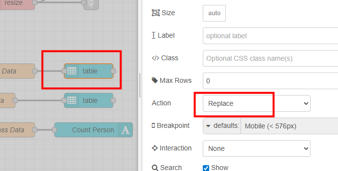

---

# `Format Count Data` Function Node

```js
const countsArr = msg.payload?.countsArr;
if (!Array.isArray(countsArr)) {
  msg.payload = [];
  return msg;
}

const dt = new Date();
const datestring = dt.toLocaleDateString();
const timestring = dt.toLocaleTimeString();
msg.payload = countsArr.map((d) => ({
  Class: d["class"],
  Count: d["count"],
  Time: `📆${datestring} ⏰${timestring}`,
}));
return msg;
```

---

# `Format Select-Class Data` Function Node

```js
// Select class here
const selectClass = "person";

// Check
const countsObj = msg.payload?.countsObj;
if (typeof countsObj !== "object" || countsObj === null) {
  msg.payload = 0;
  return msg;
}

// Code
msg.payload = countsObj?.[selectClass] ?? 0;
return msg;
```

---

# `Template` Node Configuration

```js
<template>
    <div>
        
    </div>
</template>

<script>
    export default {};
</script>
<style></style>
```
