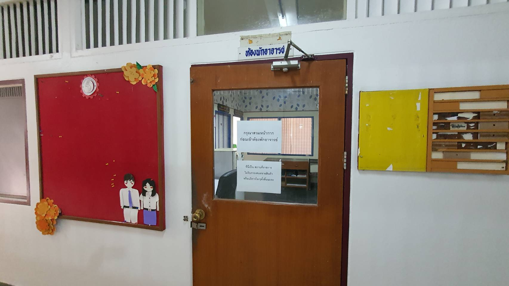
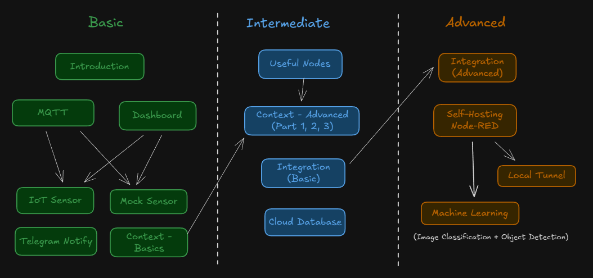

# Production Supporting Systems in Factories

## ระบบสนับสนุนการผลิตในโรงงานอุตสาหกรรม

---

# Project

> Production Support System and Business Management Using ERPNext, Node-RED, and IoT Sensors

---

# Description

- Build a **smart-company** support system using `ERPNext`, `Node-RED`, and IoT sensors.​
- Cover the full business flow from purchase, sale, inventory, and manufacturing​.

- Design `Node-RED` with IoT sensors to support real-time data collection, processing and control.

---

# Previous Year (only for `Node-RED` + IoT)

- Temperature monitoring system
- Room usage monitoring system (brightness sensor)
- Automatic Light control system
- Smart security system (face detection)
- Quality control system (image classification)
- [More](https://www.youtube.com/playlist?list=PLNGLpHQhvGrtqn6UYxUYXm7C0auAYrh_O)

---

# Grade

- 20% ของเกรด
- คะแนนเต็ม 35 คะแนน
  - คะแนน Proposal 3 คะแนน
  - คะแนน Content 27 คะแนน
  - คะแนน Presentation 5 คะแนน

---

# Proposal

- เข้ามาคุยกับผมในช่วงเวลา Proposal _(ดู Schedule หน้าถัดไป)_
  - **ไม่มา อด 3 คะแนน**
- คิดหัวข้อมาด้วย
- มารับ IoT sensor
- มาให้ผมช่วยติดตั้ง Node-RED ในเครื่อง Laptop (แนะนำให้ทำ)

---

# Project Content (ERPNext)

| เกณฑ์                 | คะแนนย่อย | ตัวอย่าง                             |
| --------------------- | :-------: | ------------------------------------ |
| Master Data           |     3     | Item / Customer/ Supplier/ BOM       |
| Purchase / Sale Flows |     3     | Order / Invoice / Receipt / Delivery |
| Manufacturing Flow    |     3     | Work Order / Stock Entry             |

---

# Project Content (Node-RED + IoT)

| เกณฑ์           | คะแนนย่อย | ตัวอย่าง      |
| --------------- | :-------: | ------------- |
| Monitoring Flow |     3     | Dashboard     |
| Control         |     3     | ON/OFF, Reset |
| Notification    |     3     | Telegram      |
| Data Storage    |     3     | InfluxDB      |

---

# Project Content (Others)

| เกณฑ์                          | คะแนนย่อย | ตัวอย่าง         |
| ------------------------------ | :-------: | ---------------- |
| ERPNext - Node-RED Integration |     3     | อะไรต่อไปไหนบ้าง |
| Overall System Design          |     3     | Diagram          |

---

# Preject Presentation

| คะแนน  | เกณฑ์                | คะแนนย่อย |
| ------ | -------------------- | :-------: |
| นำเสนอ | Slide                |     3     |
|        | Presenting / demoing |     2     |

- มา Present ในช่วงเวลา Present _(ดู Schedule หน้าถัดไป)_
- **นำเสนอกลุ่มละไม่เกิน 10 นาที**
  - แนะนำให้อัด VDO แทนการ Demo Live
  - แต่เอา Laptop มาให้ดูงานด้วย (ถ้าใช้ Node-RED ในเครื่องตัวเอง)

---

# Schedule (Sec 003/803/006/806)

| ช่วงเวลา     | วัน            |
| ------------ | -------------- |
| Proposal     | 2 Mar - 6 Mar  |
| Presentation | 9 Mar - 13 Mar |

- Location @ Office ของ อ.นิรันดร์
- นัดผ่าน [Calendly](https://calendly.com/nirand-p/prodsup-presentation)
  - สามารถนัดให้ช่วยเหลือเพิ่มเติมได้

---

# My Office

IE Build First Floor

---

# Slide

- ชื่อกลุ่ม สมาชิก
- แนะนำระบบ (ระบบทำอะไรบ้าง)
  - ส่วน `ERPNext`
    - Purchase / Sales / Inventory / Manufacturing / ...
  - ส่วน `Node-RED`
    - Monitoring, Notification, Control, Data storage
  - ส่วน Integration
    - ERPNext - Node-RED Integration (สำคัญสุด)
    - Other Integration (DB, Notification, ...)

---

# Slides (cont.)

- อธิบายการทำงานของกระบวนการต่างๆ
  - ใช้ Diagram + Screencap
- ต้องทำอะไรเพิ่มจึงจะสามารถนำระบบเราไปใช้ในโรงงานได้ (นึกถึง Edge Cases)

---

# Roadmap

